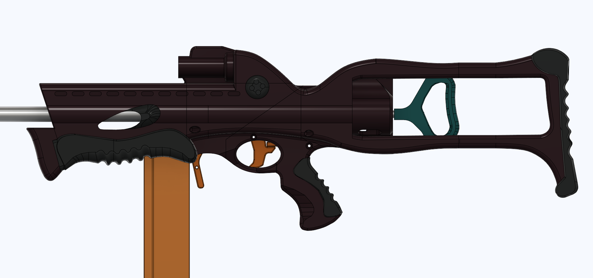
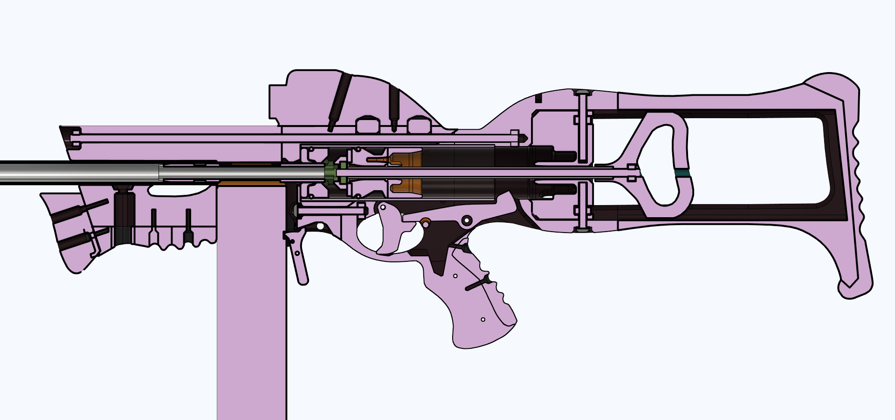
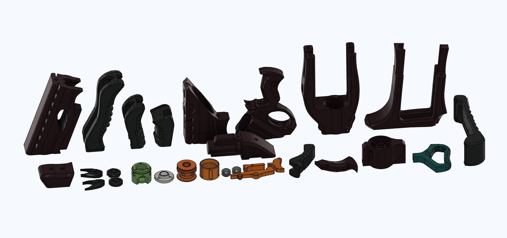
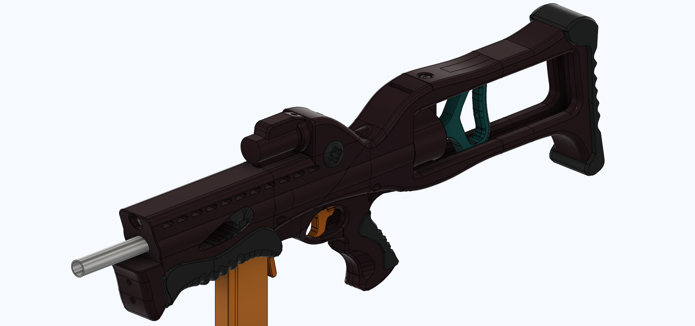
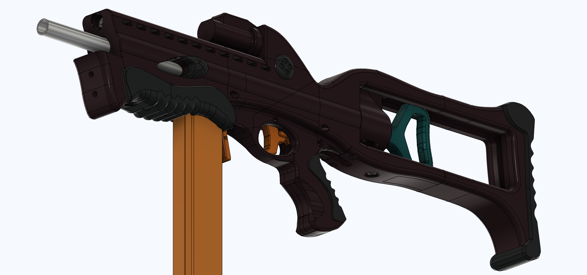
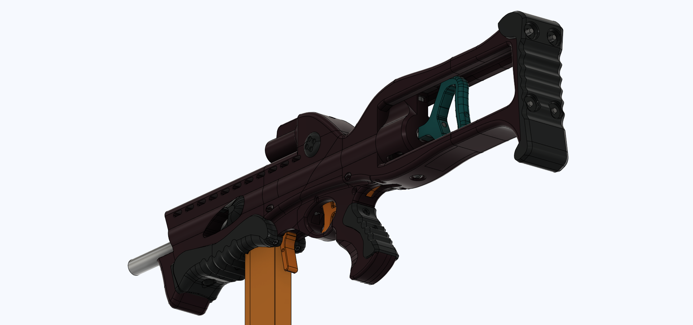
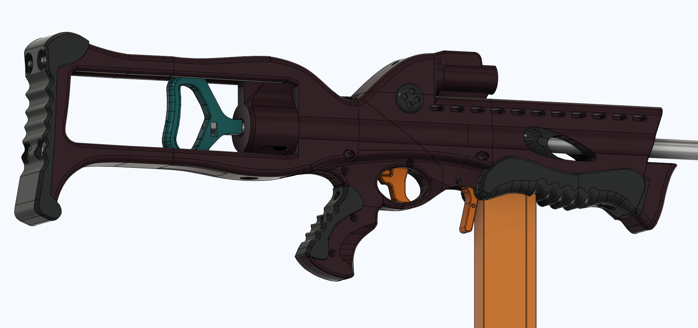
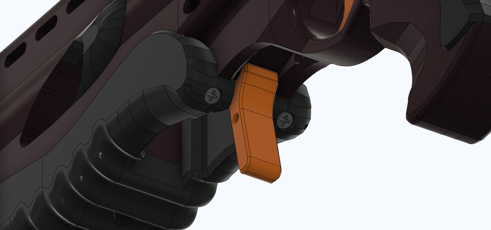
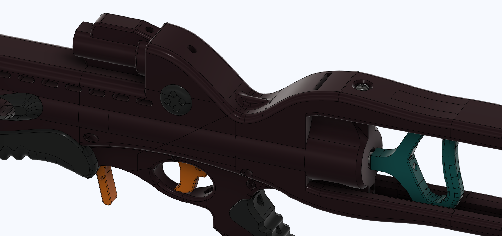

# SkewerCrossbow
The SkewBow, a Skewer inside a 1995 Crossbow, all printable.

***THIS BLASTER IS STILL IN OPEN BETA. NOT ALL PARTS, INSTRUCTIONS, OR INFORMATION ARE FINAL.***

- Changelog: 9-16-21 2:46PM EST: Changed some geometry inside the magwell of the 2Grip part, should print nicer now.

- Changelog: 9-16-21 4:42PM EST: 1Stock and threaded rods in the hardware list changed to have all 4 stock rods the same length (9 inches).

- Changelog: 9-28-21 10:00PM EST: The v2 of the SkewBow is now released. All the parts have had small tweaks done to improve printability and reliability. All externally visible parts are now modified to have better color splitting between parts. You can now make a perfect color matched SkewBow without painting prints. Five 4-40 screws have been added to the hardware list. Some of the new pieces are screwed in, some are part of the threaded rod structure, and the really small cosmetic pieces are either friction fit or glued in. 

- Changelog: 1-17-22 1:04PM EST: Updated 1stock, apparently the nut slots in it are too tight! I have no idea how they ended up like that, all my test prints had the correct hole sizing. Sorry!

**The old v1/Beta release of this blaster is zipped and included in the files for the current blaster. If you need to print a replacement bit for a v1, you still can.**

This is a printable 1995 Crossbow that uses the internal mechanism of the Skewer blaster designed by Charamile Designs (Taffy). 

https://www.youtube.com/watch?v=YjSSTB4wfps

# ***In short, its a mag fed Crossbow that you can print!***

The Crossbow part of this design was first made by Slug in 2017, only 5 months after the original Caliburn. The design had MANY problems, which this design has fixed. I am also working on a more standard printable 1995 Crossbow.

## Print Info

This design needs no supports (other than one built into the 1Grip part and the FullForegrip part). All STLs were exported in their print orientation, and a picture of the print orientation is also provided in the listing.

This uses a little bit more than a full 1kg spool of filament. Around 110ish hours of printing at 30% Gyroid, 4 wall, 70mm/s. 

I printed this on my Ender 3 v2, which has a print volume of 220 x 220 x 250 mm. 

## Extra Files

STEP and F3D files are available upon request. Please contact me via Discord (Sillybutts#5905) for those. 

## Performance

Basic overview video: https://www.youtube.com/watch?v=PaMqwsO_Oak

The performance of this blaster is the same as a Skewer, so about 210fps with good seals and a k26 with an 11" barrel.

## Hardware

**This blaster DOES NOT use a standard Skewer hardware kit. I DO NOT sell or otherwise supply hardware kits. You can buy and use most of a Skewer kit, but there are extra bits you need, and some bits in a normal Skewer that you won't need.**

*Some hardware requires some trimming. Basically, if you can't follow the measurements here, just trim the hardware lengths until they don't poke out of the blaster anymore.*

***Sorry for mixing imperial and metric, the blaster was designed in mm while Slug's hardware and the Skewer were done in inches.***

You can get all hardware from CaptainSlug, ~~but it will probably be a custom order~~ Slug apparently added SkewBow kits to his Etsy! It's an option on the Skewer hardware listing https://www.etsy.com/listing/1002947730/skewer-homemade-by-taffy-hardware-kit?variation0=2349744715. Most of this is the same as a Skewer, but there's some extra small bits, more extension springs, and more/different threaded rods.

Hardware: 
- 5.18 Inch (13cm-ish) Skewer plunger tube
- 5x Talon Claw takedown threaded rod (10-32, trim to 9 inches. One is for the skewer plunger assembly, and can be as short as 8.1 inches if need be.)
- 1x Caliburn takedown threaded rod (10-32, trim to 12 inches)
- 1x Talon Claw Ramrod
- 1x Skewer threaded rod cover (180mm long)
- 3x 1-3/4" 10-32 bolt/screw (trim one to 1.2 inches long (30mm threaded portion length))
- 1x 5/16" 10-32 bolt/screw 
- 16x 10-32 nut
- 4x optional 10-32 cap/acorn nut for the stock rods.
- 32x 4-40 screw (the small black ones. Could be replaced with Nerf screws if unavailable)
- 1x short pin from Slug, you could probably use a paper clip lol.
- 2x small extension spring (for sear and mag release)
- 2x dash-123 o-ring
- 2x 012 o-ring
- 1x 011 o-ring
- 1x round 4-40 standoff (sear pivot, I can probably make a printable version later)
- 1x TC length spring you want to use
- 1x TC length barrel you want to use
- 1x foam or rubber pad for the plunger head

More detailed list for people looking to order in bulk from McMaster: https://docs.google.com/spreadsheets/d/1xD1mAwxAeg-MQhMcJ_JEOAPvro0LUjgT-C1984fHgLI/edit?usp=sharing

## Assembly

Assembly video: Coming soon

The assembly of the SkewBow is definitely more difficult than a standard Skewer. I did my best while staying within the Crossbow form factor.

## Misc.

**If you make any of my designs, I'd love to see yours! Feel free to message me on Discord (Sillybutts#5905) or tag me on a post on Reddit (u/SillyTheGamer).**

**If you are having issues with any of my designs, let me know on Discord (Sillybutts#5905) or Reddit (u/SillyTheGamer).**

**If you wish to print and sell this item, please contact me for licensing. I can be reached on Discord (Sillybutts#5905) or Reddit (u/SillyTheGamer).**

 This work is licensed under a <a rel="license" href="http://creativecommons.org/licenses/by-nc-sa/4.0/">Creative Commons Attribution-NonCommercial-ShareAlike 4.0 International License</a>.

## If you like what I do, please consider supporting me!

**I don't charge for my files, so any donations or merch purchases would be greatly appreciated!**

 https://www.redbubble.com/people/Sillybutts/shop RedBubble full of fun Nerf-y sticker and merch designs!  

 https://www.patreon.com/sillybutts 

 https://www.buymeacoffee.com/sillybutts 

## Images

